# Performance

## on exp 12 May 17
in browser, up to 180mb memory (using task manager in chrome) and 31k javascript (about 18k live).

Keep hitting reset button on app and overall memory use increases. Need to dispose of some things!

3 heap snapshot technique and Tone.Events and Patterns are being leaked. Nothing huge by the looks of it though?

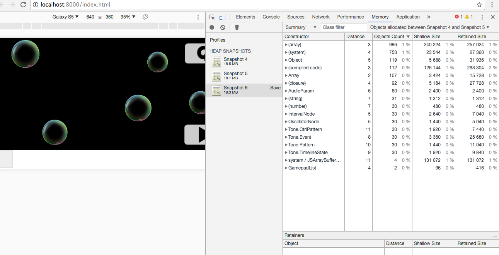

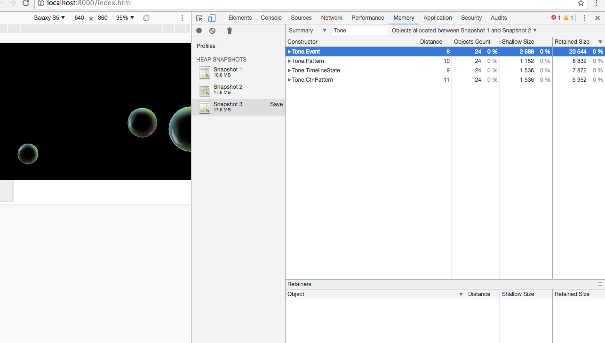

This time without filtering for Tone, and that's a big leak.
So that was a three snapshot technique, looking at the events allocated between first two; and can see big leaks. I was pressing the reset button each time. Reset should reset!

## MonoSynth testing - browser vs mobile (Cordova Crosswalk)

I have noticed some big differences in performance with an app using Tone js for music, and Phaser for visuals. Beyond three MonoSynths, sound would become intermittent, and beyond four or five, might stop completely. This was on a Samsung A5 (2017), so a reasonably powered, modern smartphone. The test consists of creating several PatternPlayer objects (my own class) that play quarter note arpeggios simultaneously. Another class, Tonality, provides chord information.

To explore this further, I stripped out the music code from the Phaser code, to see what was going on. The same performance problems emerged.

### One MonoSynth

In the browser, here's a close up of MonoSynth triggering in the browser:

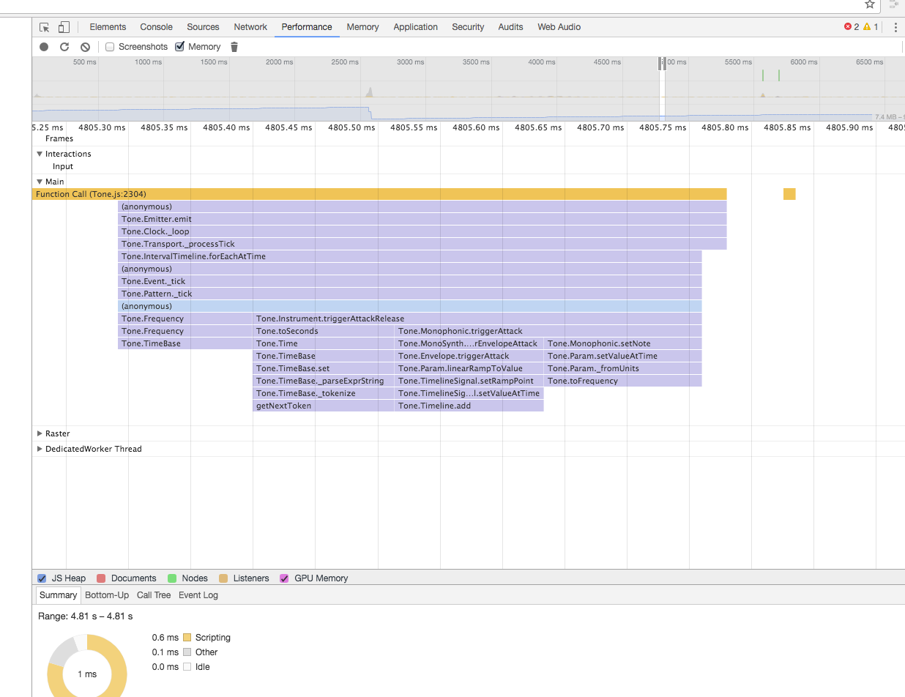

And the same code running on mobile:

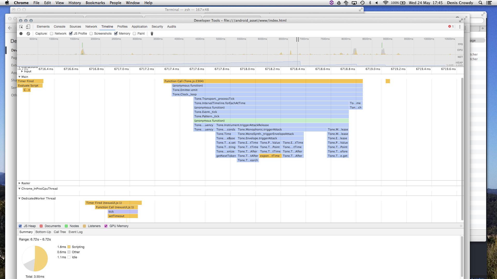

That was a fast one. Here's a slow one:

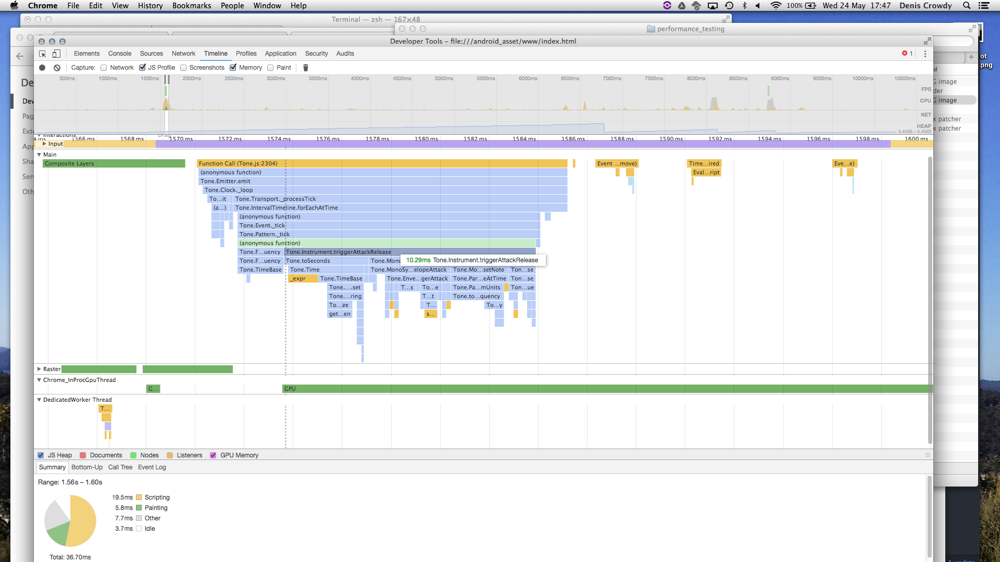

So a fair bit of difference between fast and slow on mobile.

The same pattern is evident with two and three MonoSynths respectively. Three play ok on mobile, but at four, the sound pretty much breaks up, and is inconsistent (that's on mobile). Here's four MonoSynths in the browser:

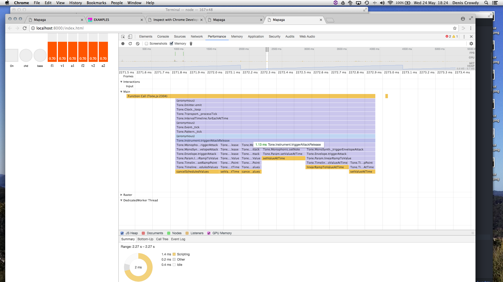

And here's four MonoSynths on the mobile:

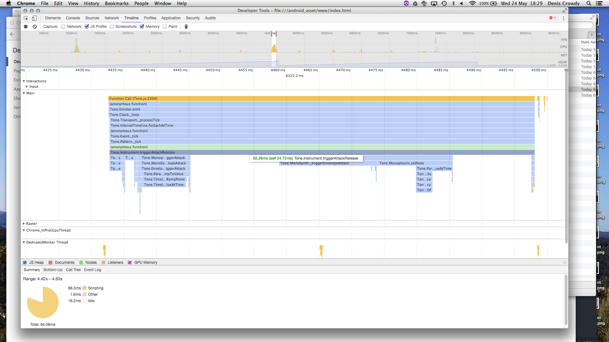

But a faster one in this run too:

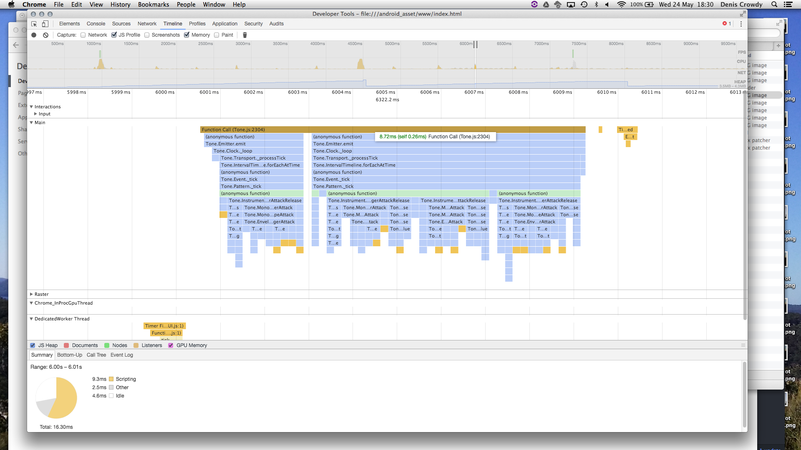

So maybe a cordova thing? Let's try the same code hosted as a website.

Desktop browser pointed at http://sandpit.motekulo.net

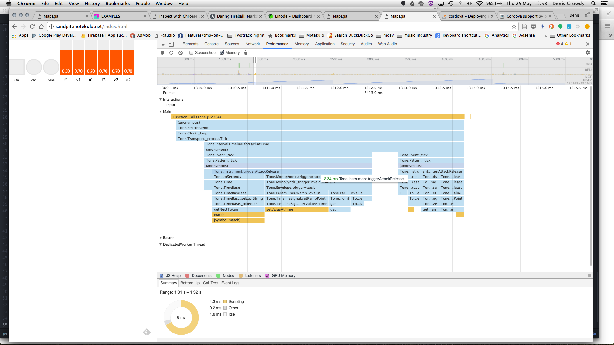

Mobile stock browser Samsung A5 2017 (com.sec.android.app.sbrowser)

Slow:

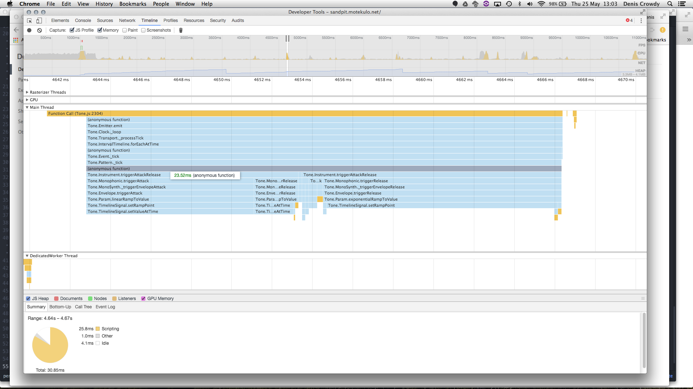

Fast:

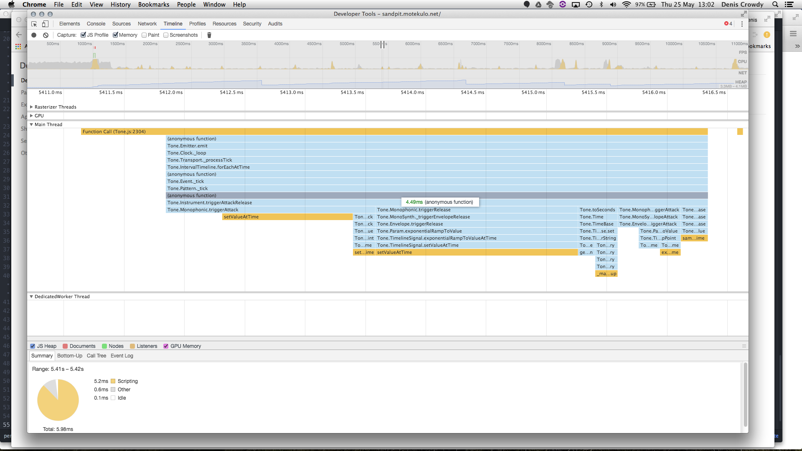

So far then, performance as a Cordova crosswalk app is the worst. That's unfortunate as it's the environment I hope to work in.

Next step, try speed in chrome browser on android (so not Samsung internet version0).

Then try more bleeding edge cordova crosswalk (see https://crosswalk-project.org/documentation/cordova.html - the optional Android platform only workflow).

Then try without crosswalk at all.

Then try other devices.

Consider a nexusUI interface with Tone js to add and remove different types of PatternPlayers to see what the performance limits are.

Test on more mobile devices.

<table>
    <tr>
        <td>Platform</td><td>Version</td><td>Slow</td><td>Fast</td>
    </tr>
    <tr>
        <td>Cordova app running in browser</td><td></td><td></td><td></td>
    </tr>
    <tr>
        <td>Cordova app with Crosswalk- Android mobile</td><td>Crosswalk stable 23+</td><td></td><td></td>
    </tr>
    <tr>
        <td>Web app from browser</td><td></td><td></td><td></td>
    </tr>
    <tr>
        <td>Web app from mobile</td><td></td><td></td><td></td>
    </tr>
</table>
